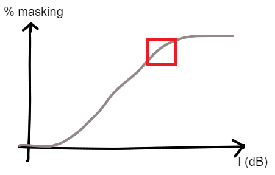

*fmaskedCAP* is for the collection of forward-masked CAPs in NEL (presentation of cosine-tapered Gaussian-noise masker followed by a click probe). It is based on the CAP code.

For more insights into Methods, check the related paper: [*Estimation of cochlear frequency selectivity using a convolution model of forward-masked compound action potentials* (on bioArxiv)](https://www.biorxiv.org/content/10.1101/2022.04.15.487700v1)

Stimuli
--------

* Maskers are defined by spectral bands. The information required for their generation is stored in .json files in the  `./stimuli/stimFiles` folder. See README in the `./stimuli` folder for more indications on the creation of the .json files. Wavefiles are generated 'on the fly' during experiment.

 * The probe is a click. It is either a pulse generated using TDT or a wavefile created using an inverse LPC filter (computed during experiment).

 * Masker and click attenuations can be set independently with the GUI and are handled by the PA attenuators.

*Folders (04/2022):*
 * *regular_expe*: around 150 maskers that were used for the main paper explaining the method (*estimation of cochlear freq. selectivity*)
 * *regular_expe_short*: same kind of expe, 68 maskers. Only probes: 3,4,5,6 kHz. Can be used for expe on compressive nonlinearities before *5kHz_difflevels*
 * *5kHz_difflevels*: various maskers with varying part around 5 kHz. To be presented with different sound levels.
 *  * *5kHz_difflevels_lowered*: same, but frequencies are lowered by a ~0.9 mult. factor.

Typical experiment
----

 * Run regular CAPs (click/audiogram). With *fmaskedCAP*, we can also test CAP without masker with 'Free run-> no masker' or by setting masker atten to min ('Free run -> broadband noise')

 * Setting masker and click levels:  
  - Inv Calib: for maskers, the same strategy as inverse filters in other parts of NEL is used (with 1st calib file), but is not done in TDT but in Matlab during the generation of the wavefiles (so NO inverse filter is loaded in TDT); for the click, an inverse filter is computed using linear prediction coding (LPC) if the user decides so at the first opening of the GUI (microphone for calib must be on).
  - After the inv filters are computed, values (info on the normalization done by matlab to avoid the saturation of wavefiles) will be displayed in the command window. **Write down these values as they are needed to find the exact sound levels delivered to the animal.**
  - click attenuation: usually around 20-25 dB (corresponding to around 80 dB SPL).
  - masker attenuation: usually around 30 dB for notched-noise maskers.  Use 'Free run -> broadband noise' and play on masker level to find the right level. Ideally you want to be at the end of the linear regime of the masking input-output curve (see fig).

 *  Run maskers (select every files in the folder of .json files you want to run) and save data. The GUI will ask if the conditions have to be shuffled before the collection of data.  For example, you can run 12 blocks of 10 masker-probe pair repetitions, and random ordering of the json files within each block. Each masking condition in each block will generate a picture file. It is advised to write down start pic # - end pic # for each block. 

2 types of experiments: 
 1. 'regular' experiment (see main paper) with notched-noise maskers and high-pass noise maskers (narrow-band analysis) and a single level of presentation. 
 2. maskers around 5 kHz (high-pass noise masker + narrowband suppressor), presented at different sound levels. You can use  'Free run -> hp6000' to find a good range of sound levels. usually the range [40 dB, 15 dB] atten by 5-dB steps is good.

Remarks on code
-------

 * Most parameters are in `fmaskedCAP_ins`, in particular: stimulus paradigm durations (fast/slow mode) and `nPairs` (number of repetitions), 
 * The generation of wavefiles during expe works with the parallel computing Matlab library. It requires some time to set up at the start of data collection.
 * There is a variable `debugStimuliGeneration` in `fmaskedCAP.m` (default:false). If True, NEL will collect input from microphone instead of CAP electrode. Useful to check if sound output is ok (note: use fixedPhase).
 * Where is the code? Free run:  `fmaskedCAP_loop.m`, run Stimuli: `fmaskedCAP_RunStimuli.m`, calls `fmaskedCAP_RunLevels.m` (only used as a script for runStimuli)
